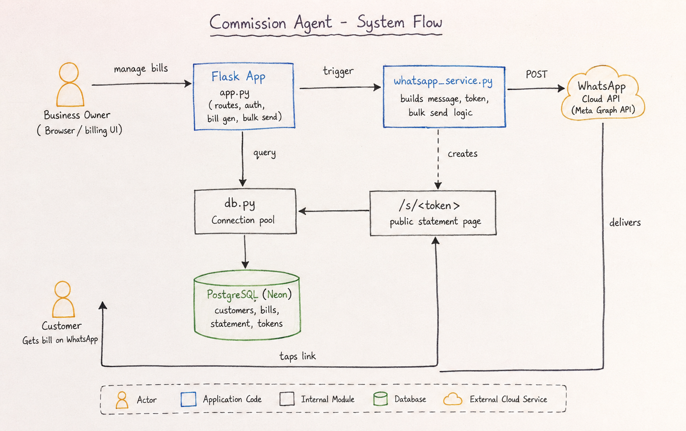
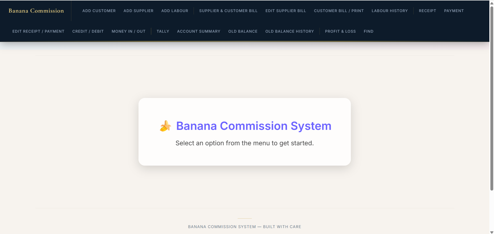
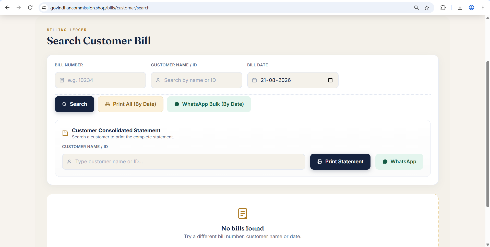
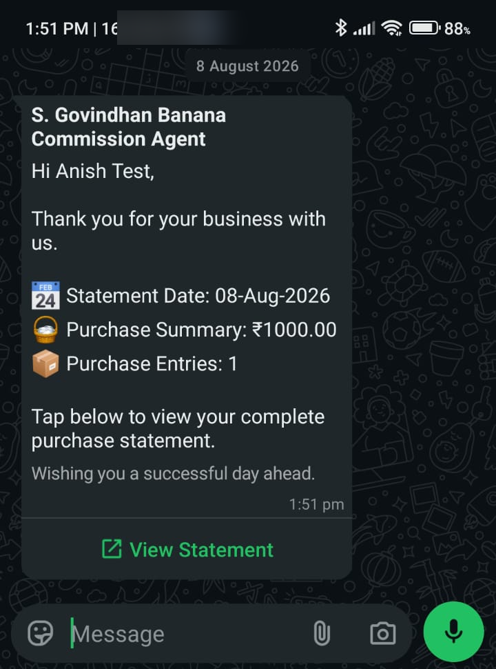

# Commission Agent

A billing and customer management web app built for a banana commission agent business, handling bill generation, customer records, and automated WhatsApp bill delivery.

**Live:** [govindhancommission.shop](https://govindhancommission.shop)

## Overview

Built end-to-end for a real commission business to replace manual paper billing with a digital system — including customer bill search, printable bill generation, and bulk WhatsApp notifications to customers.

## System Flow



## Screenshots

<table>
  <tr>
    <td align="center" width="33%">
      <br>
      <sub>Dashboard</sub>
    </td>
    <td align="center" width="33%">
      <br>
      <sub>Customer Bill Search</sub>
    </td>
    <td align="center" width="33%">
      <br>
      <sub>WhatsApp Delivery</sub>
    </td>
  </tr>
</table>

## Contributors

Built by [Anish R S](https://github.com/Anish-RS) and [Govisharj](https://github.com/Govisharj).

## Features

- Customer billing and bill history management
- Printable customer bill generation (HTML-based print templates)
- WhatsApp Cloud API integration for automated bill delivery to customers
- Bulk WhatsApp send with preview before sending
- PostgreSQL-backed data storage with connection pooling for reliability under load

## Tech Stack

- **Backend:** Python, Flask
- **Database:** PostgreSQL (hosted on Neon), via a custom connection pool built on `psycopg2`
- **Messaging:** WhatsApp Cloud API (Meta Graph API)
- **Deployment:** Vercel (serverless), auto-deploy on push
- **Server:** Gunicorn

## Engineering Highlights

- Diagnosed and fixed a production bug where unhandled request errors were leaking database connections out of a fixed-size pool, eventually exhausting it and causing intermittent 500 errors under normal multi-user traffic. Solved by wrapping connection release in a Flask `after_this_request` hook, guaranteeing every connection returns to the pool regardless of how the request ends.
- Added retry-with-backoff logic for connection checkout to smooth over brief bursts of concurrent load instead of failing requests outright.
- Configured and debugged WhatsApp Cloud API message delivery, webhook handling, and business verification for production use.

## Setup

```bash
pip install -r requirements.txt
```

Environment variables required:
- `POSTGRES_URL` or `DATABASE_URL` — PostgreSQL connection string
- WhatsApp Cloud API credentials (see `whatsapp_service.py`)

```bash
python app.py
```

## Deployment

Deployed on Vercel via `vercel.json`, auto-deploying from the `main` branch.
